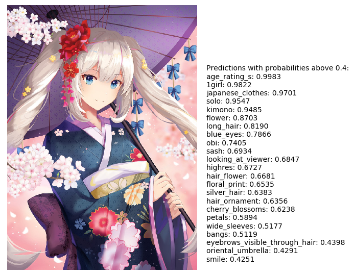

# Pytorch pretrained resnet models for Danbooru2018
This repository contains config info and notebook scripts used to train several ResNet models for predicting the tags of images in the Danbooru2018 dataset. An example of the resnet50's output is shown below.



For a rundown of using these networks, training them, the performance of each network, and other useful information, please [see the accompanying post on this](https://rf5.github.io/2019/07/08/danbuuro-pretrained.html). As in the post, it only takes a few lines of pure pytorch to get started. 

__Requirements__:
- Pytorch (>1.0)
- (optional) fastai

## Files
- `config/` contains the class names for the various number of top tags that the network predicts. For example, the resnet50's 5th output is the (unnormalized) probability of the image containing the 5th tag name in `class_names_6000.csv`.
- `training_notebooks/` contains notebooks which I based my training of the networks on. The resnet34 notebook is entirely similar to the resnet18 notebook.
- `danbooru_resnet.py` contains functions to build and load the various danbooru resnet networks (again see the [blog post](https://rf5.github.io/2019/07/08/danbuuro-pretrained.html) for details)

## References
1. Thanks a ton for the organizers of the [Danbooru2018 dataset](https://www.gwern.net/Danbooru2018)! Their citation is: 
> Anonymous, The Danbooru Community, Gwern Branwen, & Aaron Gokaslan; “Danbooru2018: A Large-Scale Crowdsourced and Tagged Anime Illustration Dataset”, 3 January 2019. Web. Accessed 2019-06-24. 
2. [Deep Residual Learning for Image Recognition](https://arxiv.org/abs/1512.03385)
3. [Fastai](https://docs.fast.ai)

## Citing
If you use the pretrained models and feel it was of value, please do give some form of shout-out, or if you prefer you may use the bibtex entry:
```tex
@misc{danbooru2018resnet,
    author = {Matthew Baas},
    title = {Danbooru2018 pretrained resnet models for PyTorch},
    howpublished = {\url{https://rf5.github.io}},
    url = {https://rf5.github.io/2019/07/08/danbuuro-pretrained.html},
    type = {pretrained model},
    year = {2019},
    month = {July},
    timestamp = {2019-07-08},
    note = {Accessed: DATE}
}

